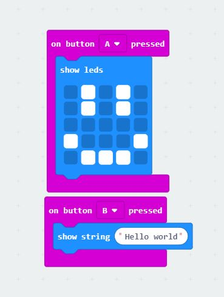
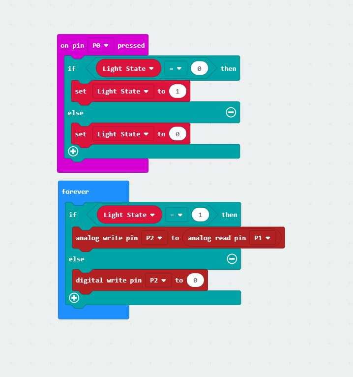

# Inventor Kit Experiments

### Say "Hello" to the BBC micro:bit ###

(Code for experiment one)

#### Reflection ####

In this experiment, something new to me was or something I learned what a microbit was, and all the capabilities and potential that the small little device can have. It is very interesting, I learnt that LED's on the screen can change, and that the microbit can move motors and make sounds aswell.  

This experiment could be the basis of a real world application such as a billboard where pixels light up on the screen. These pixels might only light up when the car triggers a sensor, that way the billboard isn't wasting unnecessary power. They could have cameras on the side of the road that looked into the car to create different advertisements on the billboard based on who is travelling. If the camera noticed a family, they could advertise a family meal at a stop nearby. However, if it is just one person in the vechile, the billboard could create an advertisement of just a singular item. 

### Using a light sensor and analog inputs ###

(Code for experiment two)
#### Reflection ####

In this experiment, something new to me was phototransistors. I learnt that this is a technical part which reacts to the changing light. The more light that is exposed to the phototransisitors the brighter it will be, the less light that is exposed, the less bright it will be. 

This experiment could be the basis of a real world application such as your phone or computer screen. The brighter the area you are in, the more the screen will compensate and get brighter so that you can see it. Once the screen goes into a darker area the screen will dim so you arn't blinded by the screen. This saves you having to manually change the brightness of the screen. 

### Dimming an LED using a potentiometer ###

(Code for experiment three)
#### Reflection ####

In this experiment, I learnt what a potentiometer was. This experiment of dimming an led using a potentiometer is controlled in a two separate block chains. One of the block chains determines if the switch is turned on or off and the other one turns the LED on. When the voltage is higher from the potentiometer, the LED shines brighter.

This experiment could be the basis of a real world application such as car headlights. When you turn on the lights, the voltage can be increased by how fast the car is going. When the car is going faster it is more useful to be able to see further in front as you are travelling more distance per second, however if you are going slower, the led can shine less bright as you do not need to see as far in front of the vehicle. I personally think that light sensors would work for this more effectively. Having the lights shine brighter in lower light, and having the lights shine less bright in brighter areas. 

### Using a transistor to drive a motor ###

(Code for experiment four)
#### Reflection ####

In this experiment, something new to me was or something I learned was (insert something here).

This experiment could be the basis of a real world application such as (insert something here).

### Using the accelerometer to control motor speed ###

(Code for experiment five)
#### Reflection ####

In this experiment, something new to me was or something I learned was (insert something here).

This experiment could be the basis of a real world application such as (insert something here).

