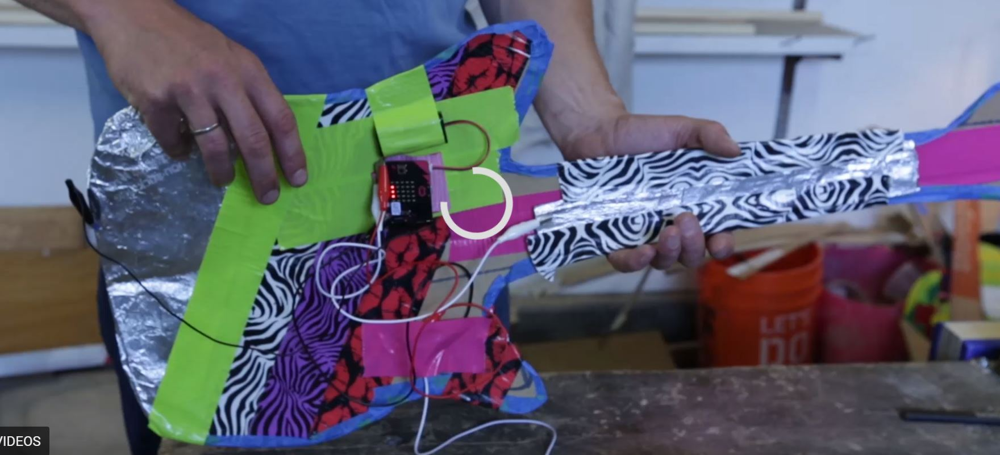
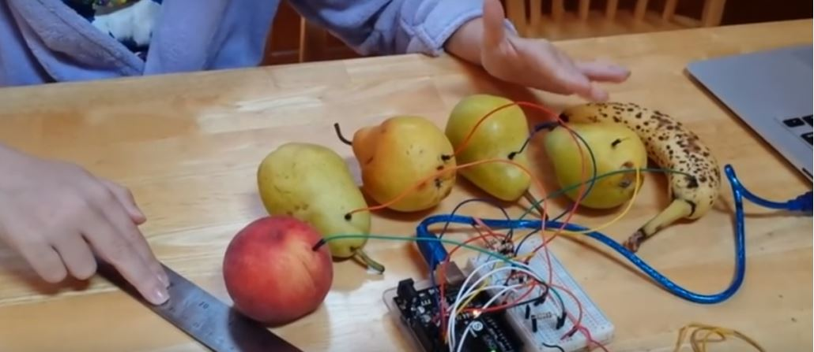
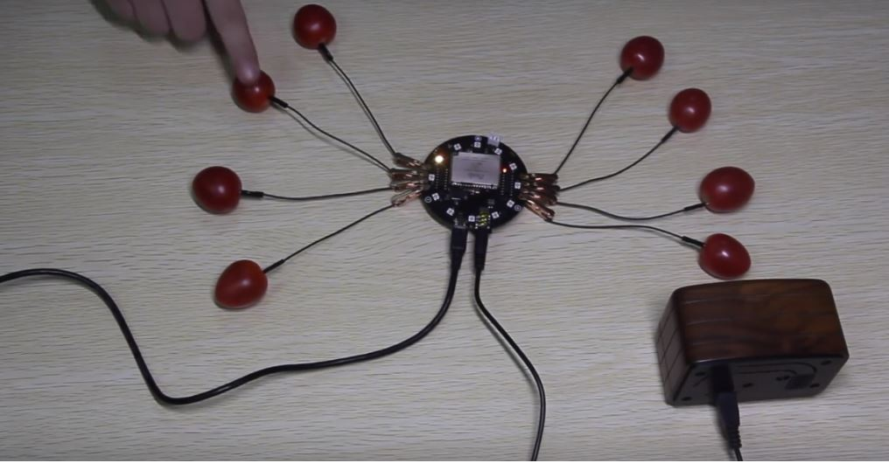
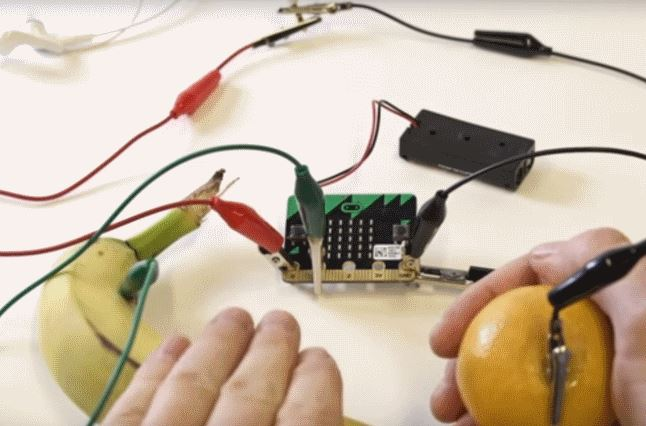
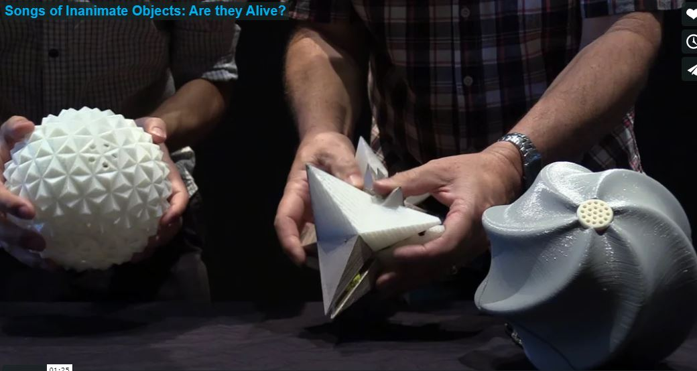

# Assessment 1: Replication project

*Fill out the following workbook with information relevant to your project.*

## Banana Keyboard Replication Project ##

## Related projects ##
*Find about 6 related projects to the project you choose. A project might be related through  function, technology, materials, fabrication, concept, or code. Don't forget to place an image of the related project in the* `replicationproject` *folder and insert the filename in the appropriate places below. Copy the markdown block of code below for each project you are showing, updating the number* `1` *in the subtitle for each.*

### Related project 1 ###
(Microbit Guitar)

(https://makecode.microbit.org/projects/guitar)

This project is related to mine because it is an object which creates sound. However, instead of using touch to complete the circuit and create a sound, this has a light sensor. This light sensor plays different notes, depending on the level of the light in the room. It would be very difficult to learn how to play, and I don't think it would be very practical as you would need to adjust depending on what type of lighting you were playing in. 

### Related project 2 ###
(Arduino Fruit Piano)

(https://www.bigmessowires.com/2016/08/19/fruit-electronics-piano/)

This project is related to mine as it fruit which plays sound. However instead of using crocadile clips, this one is connected through wires to a breadboard. This allows for each peice of fruit to create different sounds. I was considering replicating this project, however changed my mind when I saw that I only had two peices of fruit. It is a very cool concept that the different peices can create different sounds. I would like to see someone play a song using the keyboard. Or a whole band. 

### Related project 3 ###
(ReSpeaker Tomato Piano with Arduino)

(http://www.seeedstudio.com/blog/2016/09/19/respeaker-tomato-piano-with-arduino/)

This project is very similar to the previous one, however it is using tomatoes rather then all different fruits. They are using a different tool instead of a microbit, which allows for more alligator clips to be placed onto different spots. This gives potential to create more notes rather then the one tone. 

### Related project 4 ###
(Banana Keyboard)

(https://osoyoo.com/2018/09/20/microbit-basic-tutorial-9-banana-keyboard/)

This project is what I based my replication project off of. It is very similar to mine, however to connect the two fruits they used crocadile clips. Due to my lack of resources, I only had three clips and had to use a wire to connect the clips. This is similar to mine in the fact that when touched, you complete the circuit and the tonne plays. It plays a different sound.

### Related project 5 ###
(Songs of inanimate objects)
(http://www.johnrobertferguson.com/songs-of-inanimate-objects/)

This project is related to mine as they were inanimate objects which when touched, outbursed soundwaves for you to hear. This project served as inspiration to mine. I found this inspiring as cool sounds can be made from objects that seem inanimate. As I child I remember going around and knocking or tapping different objects to see what sounds they make. If I were able to play with these objects as a kid I would of thought it was so increadible. 

*For each of the assigned readings, answer the questions below.*

### Reading: Don Norman, The Design of Everyday Things, Chapter 1 (The Psychopathology of Everyday Things) ###

*What I thought before: Before reading chapter one of 'The Design of Everyday Things' I had not really every thought about the experience of the user. I have always thought of the outcome that is recieved. I had not known what affordances or signifiers were before reading this chapter. 

*What I learned: This chapter challanged my thoughts, and made me realise that when I think through to past experiences, the products with the best overal user experience have been the ones which have been my favourites. The first paragraph related to me very much, as I love working on cars, admiring cars, and driving cars. The author used visualisation and placed me into the head of the engineer. Now that I think about which cars have been the most enjoyable for me, it's the little things inside, like the feeling of the seat wrapping around you, where all the buttons and dials are and how they look and feel when you touch them. The steering wheel and gear stick can have different finishes. Leather steering wheels and carbon fibre gear sticks feel the best for me in terms of user experience. As a designer I have now learnt that the experience I create for the user of the media or product matters very much in how they experience it. When I learnt about affordances, I think that through our past experiences, we have learnt the shapes and functions of many things, and know from experience what types of things can be interacted with. We often see hinges, buttons, things we can squeeze, push and pull objects, ect. I think when we notice objects with these properties we know to interact with them. Signifiers were another new concept to me. I learnt that people look for clues to see how things work. Signifiers help people know where to look in order to use the function. They can be arrows, dots or different clues so people know which interactions to use with the object. 

*What I would like to know more about: I would like to know more about how different materials, colours and sounds affect the experience as a user. If I want to design products for a business in the future, these things will be important things to me.*

*How this relates to the project I am working on: My product could be improved with the design, hiding all the wires and making it look more clean. The fruit could also be more perfect, less imperfections and less brownness (overriping) of the fruit. The buzzer could also be upgraded for a speaker or something to produce better audio quality.*

### Reading: Chapter 1 of Dan Saffer, Microinteractions: Designing with Details, Chapter 1 ###

*What I thought before: My opinions chaged similiarly to reading the last reading. I previously thought that the small things didn't really matter and it was the overall outcome of the product that was the main purpose and goal.*

*What I learned: I learnt that the small little microinteractions with the product can create a large effect in the overall experience.I learnt that microinteractions are small little toggles or options the user can do to make the experience perfect for them. This can include hiding things, changing colours, text size and more. Reading this made me realise all the little microinteractions I have with the things I use all the time. Right now, as I am typing this, I have my page larger so I can see the small font of this webpage. I have the screen micro adjusted so that it is better for my eyes. I have the bookmarks bar hidden so that I am not distracted by website icons. It amazes me just how many small microinteractions I do everyday without realising.*

*What I would like to know more about: I would love to learn what the most important microinteractions are in terms of experience. I want to create an app that teaches people all about Parkour. I want to have categories for trick tutorials, sleep, nutrition, mindset and more. I want to learn which features that the user will care about the most, and which microinteraction buttons or features I should add.*

*How this relates to the project I am working on: The ideas of this do not directly correrlate with the ideas of my project as it is only a prototype model and is not a product ready to be manufactured. To get to that stage it would be a lot of work, 3D printing different parts and having different people help out weld peices, paint pieces, ect. to overall crease a masterpiece.*

### Reading: Scott Sullivan, Prototyping Interactive Objects ###

*What I thought before: Before this reading, because I had made a clothing company I knew about all the design, prototype and testing process the occurs. This infromation from this reading stated that designers test out the products in public and gage peoples natural reactions to see what they think about it. I knew that designers often done this as it is a useful way of testing the prodct.*

*What I learned: Describe what you now know or believe as a result of the reading. Don't just describe the reading: write about what changed in YOUR knowledge.*

*What I would like to know more about: Describe or write a question about something that you would be interested in knowing more about.*

*How this relates to the project I am working on: Describe the connection between the ideas in the reading and one of your current projects or how ideas in the reading could be used to improve your project.*

## Interaction flowchart ##
*Draw a flowchart of the interaction process in your project. Make sure you think about all the stages of interaction step-by-step. Also make sure that you consider actions a user might take that aren't what you intend in an ideal use case. Insert an image of it below. It might just be a photo of a hand-drawn sketch, not a carefully drawn digital diagram. It just needs to be legible.*

## Process documentation

*In this section, include text and images that represent the development of your project including sources you've found (URLs and written references), choices you've made, sketches you've done, iterations completed, materials you've investigated, and code samples. Use the markdown reference for help in formatting the material.*

*This should have quite a lot of information!*

*There will likely by a dozen or so images of the project under construction. The images should help explain why you've made the choices you've made as well as what you have done. Use the code below to include images, and copy it for each image, updating the information for each.*

*Include screenshots of the code you have used.*

## Project outcome ##

*Complete the following information.*

### Project title ###

### Project description ###

*In a few sentences, describe what the project is and does, who it is for, and a typical use case.*

### Showcase image ###

*Try to capture the image as if it were in a portfolio, sales material, or project proposal. The project isn't likely to be something that finished, but practice making images that capture the project in that style.*

### Additional view ###

*Provide some other image that gives a viewer a different perspective on the project such as more about how it functions, the project in use, or something else.*

### Reflection ###

*Describe the parts of your project you felt were most successful and the parts that could have done with improvement, whether in terms of outcome, process, or understanding.*

*What techniques, approaches, skills, or information did you find useful from other sources (such as the related projects you identified earlier)?*

*What ideas have you read, heard, or seen that informed your thinking on this project? (Provide references.)*

*What might be an interesting extension of this project? In what other contexts might this project be used?*
